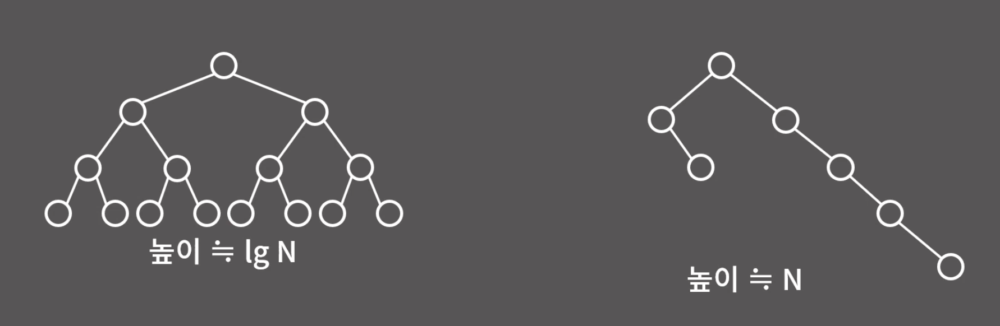

# 이진 검색 트리 (Binary Search Tree)

> 자식이 2개 이하로 존재하는 트리 구조로, 부모 노드의 왼쪽에는 부모보다 작은 숫자의 노드가, 오른쪽에는 부모보다 크거나 같은 숫자의 노드가 위치한다.
>
> insert, search, erase, find 등의 연산이 모두 `O(logN)`의 시간 복잡도를 갖는다.

### 해시와 비교

- 해시는 최대 `O(1)`의 성능을 가져갈 수 있다.
- 그렇다고 해서 무조건 `해시 > 이진 검색 트리` 일까?
  - ⭐️ 이진 검색 트리는 **"정렬 상태를 유지"** 하는 특징을 가지고 있다. _(해시의 경우 정렬된 상태를 유지하지 않는다.)_

### erase 과정

이진 검색 트리의 연산 과정에서도 erase 과정이 가장 복잡하다. case를 아래와 같이 세 가지로 나눌 수 있다.

#### 1. 자식 노드가 없는 노드를 삭제하는 경우

- 해당 노드를 바로 삭제한다. _(이진 트리 구조 유지)_
  .png>) 출처: https://youtu.be/IKnjzmyk70U?si=OECGvXVeXJhW3_LK

#### 2. 자식 노드가 하나인 노드를 삭제하는 경우

- 자식 노드를 지워진 노드의 위치로 옮긴다.
  .png>)

#### 3. 자식 노드가 두 개인 노드를 삭제하는 경우

1. 지워진 노드의 위치에 `(지워진 노드보다 큰 숫자의 노드 중, 가장 작은 숫자의 노드)`를 옮긴다.
   - 지워진 노드의 **우측 자식 노드**에 접근한 후, **좌측 노드**가 존재하지 않을 때까지 탐색한다.
     .png>)
2. 지워진 노드의 위치에 `(지워진 노드보다 작은 숫자의 노드 중, 가장 큰 숫자의 노드)`를 옮긴다.
   - 지워진 노드의 **좌측 자식 노드**에 접근한 후, **우측 노드**가 존재하지 않을 때까지 검색한다.

## 이진 검색 트리의 문제점

### 편향 트리

> **[사전 지식]** 노드 접근 시간 복잡도는 트리 높이에 비례한다.

- 사진처럼 자식 노드가 한 방향으로 편향될 경우, 시간 복잡도가 `O(N)`이 되어서 연결 리스트의 성능과 별 차이가 없어진다.

#### 자가 균형 트리

> 트리가 편향될 경우, 편향성을 해소하여 성능 저하를 막을 수 있다.

- AVL 트리
- Red Black 트리 _[💕성능이 더 좋다]_
  - STL - `set`, `multiset`, `map`
